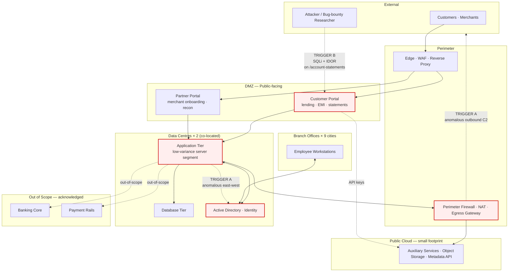
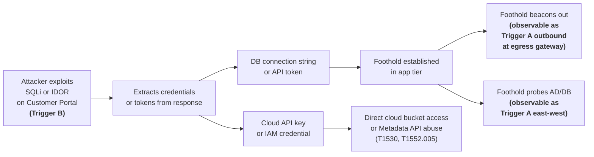
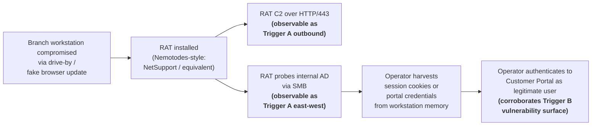
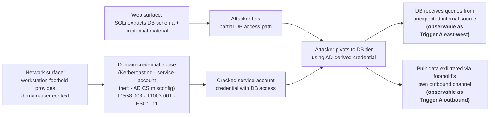

# Threat Model — Version 0 (Sketch)

> *Iteration 1 deliverable. This is a sketch, not the engagement's joint threat model. The Workstream C.1 deliverable in Iteration 4 will refine, prune, and substantiate or dismiss the candidate chains laid down here. Nothing on this page is a finding; everything is a hypothesis.*

## Purpose

This document does three things, and only three things:

1. Make Meridian FinServe's notional architecture concrete enough to reason about.
2. Place both of the engagement's triggers on that architecture so the "two surfaces" hypothesis stops being abstract.
3. Lay down three candidate cross-surface attack chains as testable hypotheses for Iteration 4.

Everything else — STRIDE/PASTA decomposition, threat actor profiling, attack tree depth, control mapping, cost-loaded mitigations — is **deliberately deferred to Workstream C.1**.

## 1. Architecture sketch

## 2. Architectural assumptions (inferred from §1.1 of the brief)

The brief gives high-level structure but no detailed topology. The following assumptions fill the gap; each is the *minimum reasonable interpretation* of what the brief states, and each is something Meridian's real engineering team would be asked to confirm at the start of a real engagement.

| Element | Stated in brief | Assumed here |
|---|---|---|
| Customer & partner portals | ✓ | Both terminate at a single edge layer (WAF + reverse proxy) and route to a shared application tier inside the data centre. |
| Two co-located data centres | ✓ | One acts as primary, one as warm secondary; replication is bidirectional for some tiers (DB) and one-way for others (backup). |
| Branch offices × 9 | ✓ | Each branch joins the central AD domain; workstations are typical Windows endpoints. |
| Small public-cloud footprint | ✓ | Auxiliary services only (not the primary application stack); likely shared services like email, document storage, or marketing telemetry. **Trust boundary:** portal application servers hold cloud API keys / IAM role credentials; SSRF on the portal could expose the Instance Metadata Service (T1552.005), and over-permissive bucket policies could expose object storage contents directly (T1530). |
| Server segment with low-variance baseline | ✓ (Trigger A) | This is the **Application Tier** in the diagram — the segment whose flows the SOC characterised as predictable. |
| Customer portal IDOR / SQLi | ✓ (Trigger B) | The vulnerable endpoint is on the customer portal specifically (per brief), not the partner portal. |
| Egress path from app tier | inferred | All application-tier outbound traffic transits the **Perimeter Firewall / NAT / Egress Gateway** (`FW_NAT` in the diagram). Direct app-server-to-internet connectivity is not assumed. Trigger A's outbound observation is therefore *visible at the egress point*, which is also where future egress filtering controls would be applied. |

Four boundaries are load-bearing for the threat model:

- **Perimeter ↔ DMZ.** Edge filtering, WAF rule coverage, and TLS termination live here.
- **DMZ ↔ Data Centres.** Whether app-tier servers can be reached from the DMZ on more than just the expected API ports is the critical control point for Chain 1.
- **Branch ↔ Data Centres.** Whether a compromised branch workstation can reach internal AD or DB directly determines the severity of Chain 2 and Chain 3.
- **DMZ / App Tier ↔ Public Cloud.** Which cloud resources are reachable using portal-held credentials, and whether the IAM scope of those credentials follows least-privilege, determines the cloud-pivot surface for Chain 1.

## 3. The two triggers, placed

**Trigger A — Network.** The 72-hour anomalous east-west *and* outbound traffic originates from the **Application Tier** inside the data centres. East-west surfaces as flows toward **AD/Identity** (the Nemotodes capture's analogue: SMB-to-DC traffic, NTLMSSP probes, MS-EFSR activity). Outbound surfaces at the **Perimeter Firewall / Egress Gateway** as flows toward external destinations that violate the segment's historical egress baseline (Nemotodes analogue: NetSupport RAT C2 over plain HTTP on `:443`).

**Trigger B — Web.** The bug-bounty researcher's disclosure identifies SQL injection and IDOR on the **Customer Portal**, specifically on an account-statements path. The vulnerable endpoint is reachable from the public internet via the edge / WAF.

The two triggers are *spatially distinct* on the architecture — different zones, different trust boundaries, different observability surfaces. That spatial separation is exactly what makes the "two surfaces" hypothesis non-trivial: the engagement has to bridge them with evidence.

## 4. Candidate cross-surface chains

Three chains are proposed at the napkin level. They span the three structural possibilities: web-first (compromise observed externally, downstream impact internal or cloud), network-first (compromise observed internally, downstream impact external), and combined (both surfaces compromised independently then linked). Each chain has clear hooks into Workstreams A, B, and C, and each is a *hypothesis to test* — not a finding.

### Chain 1 — Web-first (Trigger B causes Trigger A, or pivots to cloud)

**Hypothesis.** The portal vulnerability disclosed by the bug-bounty researcher was exploited prior to or during the 72-hour window. The harvested artefact was either an internal-system credential (leading to an app-tier foothold whose anomalous flows the SOC observed) or a cloud API key (leading to direct cloud-resource compromise that may not register at the on-premises SOC at all).

**Falsifiable by:** absence of credential-extracting SQLi payloads in the portal logs; absence of any successful internal authentication using portal-tier service accounts from anomalous source IPs; cloud access logs (if available) showing no anomalous portal-credential usage; the network-tier indicators of compromise resolving to a fundamentally different initial-access vector.

**Tested in:** Workstream B will confirm exploitability of SQLi/IDOR against the DVWA + Juice Shop analogues. Workstream A will determine whether the captured network indicators are consistent with a web-originated initial access. Workstream C will reconcile, including whether the cloud-pivot variant requires evidence outside the captured PCAP to be substantiated.

### Chain 2 — Network-first (Trigger A causes Trigger B)

**Hypothesis.** A branch workstation was compromised through a commodity drive-by infection (analogue: the Nemotodes capture). The on-host RAT operator then leveraged the foothold to authenticate to the customer portal using stolen sessions and trigger the IDOR/SQLi-style behaviour the bug-bounty researcher independently rediscovered.

**Falsifiable by:** no portal authentication events from compromised branch IPs during the 72-hour window; the vulnerability disclosure timing predating any plausible network compromise.

**Tested in:** Workstream A will identify the branch workstation and the foothold mechanism. Workstream B will demonstrate the portal vulnerabilities exist independent of any compromise chain. Workstream C will examine whether the temporal sequence supports network-first causation.

### Chain 3 — Combined (independent compromise of both surfaces, then convergent abuse via AD)

**Hypothesis.** The two triggers are observations of a single coordinated intrusion that combined external and internal initial access. The bridge between the workstation foothold and the database tier — which would otherwise be blocked by standard segmentation — is *domain credential abuse* against the AD environment: Kerberoasting a service account with DB access, theft of a domain service-account credential from a compromised host, or exploitation of an AD Certificate Services misconfiguration. The intrusion's *impact* phase (data exfiltration) traverses internal flows the portal alone would never have produced.

**Falsifiable by:** evidence the two compromises were operationally unrelated (different toolsets, different timing, different infrastructure); absence of AD service-ticket requests or anomalous LDAP/SAMR activity in the captured window; the network anomaly being fully explained without web involvement.

**Tested in:** Workstream A.3 will look for the specific AD-abuse signatures (TGS-REQ for SPN-registered service accounts, anomalous SAMR enumeration, certificate template requests). Workstream B will independently characterise the portal surface. Workstream C will examine whether the combined picture requires *both* surfaces to be compromised to fit the evidence, or whether either alone is sufficient.

## 5. What this v0 deliberately does *not* do

These items are scoped out of Iteration 1 by design. They are the substance of Workstream C.1 in Iteration 4.

- **No formal STRIDE or PASTA decomposition.** Chains are described narratively; threat trees are not constructed.
- **No threat-actor profiling.** Whether the adversary is opportunistic, financially motivated, or state-aligned is not addressed.
- **No control mapping.** The architecture is not annotated with existing controls (WAF rules, NSM coverage, segmentation policy) because Meridian is fictional and the brief deliberately withholds detail to force the engagement to develop a defence-in-depth proposal from scratch.
- **No impact scoring.** CVSS-style severity ratings are not assigned to chains; the C.1 threat model will do this with reference to the engagement's specific findings.
- **No defence allocation.** Which control belongs to which layer of defence in depth is the deliverable of C.2, not this document.

## 6. Forward references

| Element | Will be tested or developed in |
|---|---|
| Architectural assumptions in §2 | Workstream A.5 (architecture proposal) — current-state diagram will be the diagram above, hardened-state diagram will be its successor, with the `FW_NAT` node as the natural anchor for egress-filtering and DNS-firewall recommendations |
| Trust boundaries in §2 (incl. cloud) | Workstream C.2 (defence-in-depth proposal) — each boundary will receive a costed control set; the DMZ ↔ Cloud boundary will receive specific attention on IAM scope and metadata-service hardening |
| Trigger A placement | Workstream A.2–A.4 — IOCs from the Nemotodes capture will populate the trigger's observability profile, with egress-point observations distinguished from internal-host observations |
| Trigger B placement | Workstream B.2–B.4 — DVWA / Juice Shop exploitation will instantiate the disclosed vulnerability classes |
| Chain 1's cloud-pivot variant | Workstream B (SSRF testing) and Workstream C.1 (whether the cloud variant is in scope given the brief's "no cloud bill" constraint) |
| Chain 3's AD-abuse bridge | Workstream A.3 (look for TGS-REQ, SAMR enumeration, certificate template requests in the Nemotodes capture) and Workstream C.1 (synthesis with whatever AD signatures the capture actually shows) |
| Chains 1–3 | Workstream C.1 (joint threat model) — at least two will be developed in full, with packet-level and request-level evidence from A and B |
| What's *not* in this v0 | Workstream C.1 and C.2 explicitly |

---

*Document version: v0.1 (Iteration 1, Frame). Updated to add a perimeter egress anchor (`FW_NAT`), explicit cloud trust boundaries, and an AD-abuse bridge in Chain 3. Next refinement at Iteration 4 (Synthesise) as the Workstream C.1 joint threat model.*
